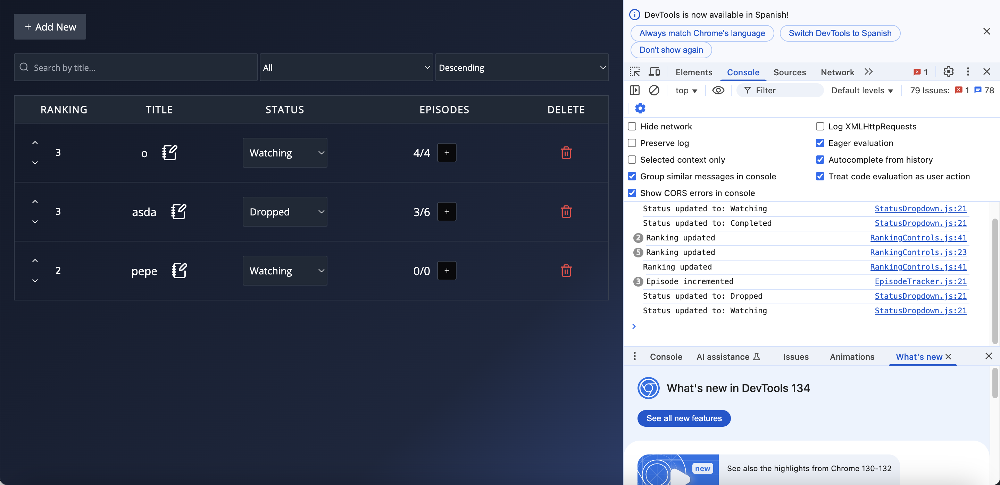

# 📺 Series Tracker - Backend en Rust

Este es el backend de **Series Tracker**, una aplicación que permite a los usuarios llevar el control de las series que están viendo. El backend está desarrollado en **Rust** utilizando [Actix Web](https://actix.rs/) como framework web y [SQLx](https://github.com/launchbadge/sqlx) como ORM con base de datos **SQLite**.

---

## 🔧 Funcionalidad

Este backend expone una API RESTful que permite:

- Obtener todas las series (con filtros opcionales por título, estado y orden por ranking)
- Obtener una serie específica por ID
- Crear nuevas series
- Actualizar series existentes
- Eliminar series
- Cambiar el estado de una serie (`PATCH /status`)
- Aumentar el episodio actual (`PATCH /episode`)
- Votar positiva o negativamente (`PATCH /upvote`, `PATCH /downvote`)

---

## 📄 Endpoints

| Método | Endpoint                         | Descripción                             |
|--------|----------------------------------|-----------------------------------------|
| GET    | `/api/series`                    | Obtener todas las series (con filtros)  |
| GET    | `/api/series/{id}`               | Obtener una serie por ID                |
| POST   | `/api/series`                    | Crear una nueva serie                   |
| PUT    | `/api/series/{id}`               | Actualizar una serie por ID             |
| DELETE | `/api/series/{id}`               | Eliminar una serie                      |
| PATCH  | `/api/series/{id}/status`        | Cambiar estado de la serie              |
| PATCH  | `/api/series/{id}/episode`       | Aumentar episodio actual                |
| PATCH  | `/api/series/{id}/upvote`        | Incrementar puntuación (ranking)        |
| PATCH  | `/api/series/{id}/downvote`      | Disminuir puntuación (ranking)          |

### 🧠 Parámetros de búsqueda (GET `/api/series`)

Puedes usar filtros vía query string:

- `search`: Buscar por título (ej. `search=naruto`)
- `status`: Filtrar por estado (ej. `status=Watching`)
- `sort`: Orden por ranking (`asc` o `desc`)

Ejemplo:
```
GET /api/series?search=naruto&status=Watching&sort=desc
```

---

## 📦 Docker y CORS

Este proyecto incluye un archivo `docker-compose.yml` que levanta el servicio del backend.

Se ha definido una variable de entorno:

```
FRONTEND_URL=http://localhost
```

Esta variable es utilizada por el backend para permitir peticiones CORS exclusivamente desde esa URL. Puedes editarla fácilmente en `docker-compose.yml` para adaptarla al entorno desde el que se esté ejecutando el frontend.

---

## 🚀 Cómo levantar el backend con Docker

```bash
# Levantar el contenedor
docker-compose up --build
```

Por defecto, la API estará disponible en:

```
http://localhost:8080/api/series
```

---

## 🔁 Colección de Postman

Puedes importar esta colección en Postman para probar los endpoints de forma interactiva:

📎 **[Enlace a la colección de Postman](https://uts-128837.postman.co/workspace/UTS's-Workspace~d006817e-8432-4670-8f83-411ceb1e9109/collection/43887446-40c2bec3-7c95-4cdb-ad23-fe95c63453c4?action=share&creator=43887446)**

---

## 🖼 Captura de funcionamiento

A continuación una imagen mostrando la integración del backend con el frontend:

📷 ****

---

## 🧪 Tecnologías utilizadas

- 🦀 **Rust**  
- ⚡ **Actix Web**  
- 🗄️ **SQLite** (con SQLx)  
- 🐳 **Docker + Docker Compose**  
- 🌐 **CORS con soporte dinámico via `FRONTEND_URL`**

---

## ✅ Estado del proyecto

✅ Backend funcional y probado con frontend  
🛠 Se puede extender con autenticación, favoritos, reseñas y más.
